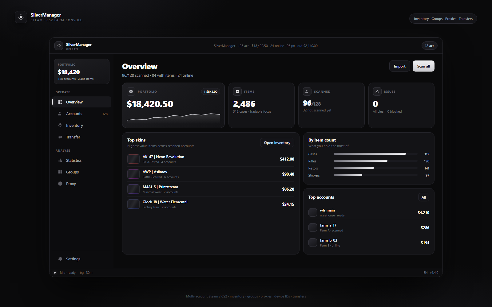

# SilverManager

<p align="center">
  
</p>

**Windows desktop app for multi-account Steam / CS2 inventory, groups, proxies, device IDs, and transfers.**

Native **.NET 8 + Avalonia** · English & Russian UI · portable single-file EXE.

> Not a farm client. Auto-farm / drops: use [MonkePanel](https://www.monkepanel.com). SilverManager handles inventory, warehouses, and trades.

## Features

| Area | What it does |
|------|----------------|
| **Accounts** | Import `login:pass` + maFiles, select, groups, scan |
| **Inventory** | CS2 skins grid, filters, smart select, send |
| **Transfer** | Sources → warehouse or trade link; per-group routing |
| **Groups** | Collapsible farms, members, warehouse, trade link |
| **Incoming** | Load offers on warehouse accounts, accept deposits |
| **Proxy** | Per-account / pool / default (scan & login) |
| **Device IDs** | Unique HWID profile per account (MachineGuid + PC name) |
| **Stats / Review** | Portfolio, ban check (API key), action log |

## Run

1. Build or grab `SilverManager.exe` (see below).
2. **Recommended:** right-click → **Run as administrator** (full Device ID registry spoof).
3. First launch: pick **English** or **Русский** (change anytime in the rail).

Settings live under `%LocalAppData%\SteamVault\` (not in this repo).

## Build

```powershell
dotnet publish SteamVault/SteamVault.csproj -c Release -r win-x64 --self-contained true
# or
.\publish.ps1
```

Output: `dist\SilverManager.exe`

## License

MIT — see [LICENSE](LICENSE).
